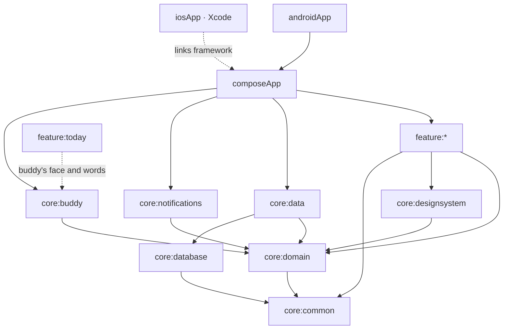

# DayBlocks

Plan your day in time blocks — and have a small, cheeky buddy who checks in, asks whether you're
actually doing the thing, and nudges you back when the phone wins.

DayBlocks exists because a passive planner is easy to ignore. Planning the day, even loosely, and
sticking to it helps; what makes the difference is something that *talks back*. So the core of
the app isn't the timeline, it's **Kubi**: an original rounded-block creature (rename it whatever
you like) who notices when a block starts, asks halfway through whether you're still on it, and
reacts to how the day is going.

Everything is local. No account, no backend, no network.

## Status

Built step by step, each step verified on both an Android emulator and an iOS simulator before
the next begins. See the [issues](https://github.com/Meko123456/DayBlocks/issues) for the plan.

| Step | Scope | State |
|---|---|---|
| 1 | Skeleton: modules, convention plugins, catalog, Koin, empty navigation | ✅ |
| 2 | Domain models, use cases, database, repositories | ✅ |
| 3 | Today screen: timeline, Now card, free-time gaps | ✅ |
| 4 | Add / edit block | ✅ |
| 5 | Templates and weekday assignment | ✅ |
| 6 | Notifications with action buttons, both platforms | ✅ |
| 7 | Buddy engine and buddy UI | ✅ |
| 8 | End-of-day check-in and stats | ✅ |
| 9 | Widgets: Android Glance, iOS WidgetKit | ✅ |
| 10 | Onboarding and settings | — |

## Architecture

Kotlin Multiplatform with Compose Multiplatform for the UI, one codebase for Android and iOS.

- **Clean Architecture.** `:core:domain` holds the models, repository interfaces and use cases, and
  is pure Kotlin: its only dependencies are kotlinx-datetime and coroutines. It cannot import
  Compose, Android or SQLDelight — they are not on its compile path.
- **MVI** in every screen: an immutable `State`, a sealed `Intent` for user actions and a sealed
  `Effect` for one-off events such as navigation. The ViewModel exposes `StateFlow<State>` and
  `Flow<Effect>`, and every intent goes through one reducer path.
- **Koin**, one module per Gradle module. `:composeApp` is the only place the full list is
  assembled and the only place Koin is started.
- **An injectable clock.** Nothing reads the system time directly; everything asks
  `TimeProvider`, so tests can move time through midnight, a DST change or a quiet-hours boundary.

### Module graph



`feature:*` is `onboarding`, `today`, `editblock`, `templates`, `checkin`, `stats` and `settings`.

Two rules the build enforces rather than documents:

1. **Features never depend on each other.** The `dayblocks.kmp.feature` convention plugin grants a
   feature its core dependencies and nothing else, so importing one feature from another does not
   compile. Screens raise navigation effects; only `:composeApp` knows the graph.
2. **Features never see `:core:data`.** They talk to repository interfaces in the domain. The
   implementations are bound at startup, so a screen cannot reach the database even by accident.

### Convention plugins (`build-logic`)

| Plugin | Adds |
|---|---|
| `dayblocks.kmp.library` | KMP with Android (via AGP 9's `com.android.kotlin.multiplatform.library`), `iosArm64`, `iosSimulatorArm64`; namespace derived from the project path; host tests |
| `dayblocks.kmp.compose` | Compose Multiplatform runtime, foundation, ui, Material 3 |
| `dayblocks.kmp.koin` | Koin core, plus koin-test for tests |
| `dayblocks.kmp.feature` | All three, plus domain, design system, lifecycle ViewModel, coroutines-test and Turbine |

Versions live in `gradle/libs.versions.toml` and match the rest of the fleet: AGP 9.4.1,
Kotlin 2.4.20, Gradle 9.7.1, Compose Multiplatform 1.11.0, compileSdk 37.

## Reminders

What the buddy says, and when, is worked out in one place and delivered by each platform in its
own way.

**When.** `NotificationPlanner` in `:core:buddy` is pure Kotlin. From the plan it works out the
next 36 hours of notifications, at most 64 of them, since iOS holds no more than that:

| Notification | When |
|---|---|
| Block start | At the block's start: *"Hey! It's 13:00. Time for “Reading” 📖 You've got 2 hours."* |
| Mid-block check-in | Halfway through a block of an hour or more (never Sleep), with **On it ✅ / Got distracted 😅 / Skip this block** |
| Follow-up | Ten minutes after "Got distracted", if five minutes or more are left |
| Planning | 20:00 when tomorrow has nothing planned and no template, and again at 08:30 if it still has not |
| End of day | Ten minutes after the day's last waking block |

Everything is computed on real instants. A block across midnight fires on the right calendar
day. In the hour a DST change skips, a block starts at the first moment that exists, and its
length is how long it actually lasts. The clock in the text follows the device's 12- or 24-hour
setting. On top of that sit the buddy's own rules: its tone, quiet hours and the daily cap,
described under [The buddy](#the-buddy).

**Rebuilt, never patched.** `ReminderRescheduler` in `:composeApp` rebuilds the whole window
whenever anything it depends on changes:
- the plan, an answer or a template assignment
- a new planning day
- on Android: a reboot, an update, the clock, time zone, 12/24-hour or language changing,
  exact alarms being allowed, and a 12-hourly refresh
- on iOS: the app coming to the foreground, a significant time change, and background refresh

Days the window reaches get their template first, so tomorrow's 07:00 run is scheduled tonight
whether or not the app is opened. Answers are recorded as they are given. The check-in is
prefilled from them, and the follow-up is derived from them, so it survives any reschedule.

**Android.** One exact alarm per notification, and one notification channel per kind, so each
kind can be silenced on its own. Exact timing needs the *Alarms & reminders* permission, which
Android 14 no longer grants by default. Today shows a notice with a link to the system page, and
without the permission reminders arrive within ten minutes. A check-in's buttons go to a
receiver that writes the answer to the database without opening the app.

**iOS.** `UNUserNotificationCenter` with a check-in category that carries the three buttons.
Triggers are calendar dates in the device's zone, so a plan follows its owner across time zones
as the app itself does. The Swift notification delegate hands each answer to Kotlin.

## The buddy

Kubi is an original mascot: a rounded block with a sprout on top, drawn in code
(`BuddyFace` in `:core:designsystem`), with a face for each of six moods. Happy, proud,
encouraging, worried, disappointed (playfully, never guilt-tripping) and sleepy. Tap it on Today
to rename it.

The engine in `:core:buddy` is pure Kotlin and decides everything the buddy says and when:

- **What it says.** Each situation (block start, check-in, follow-up, planning, streak, comeback,
  review) has its own pool of lines in each tone, with placeholders for the block's title, the
  time left or the streak. Lines rotate deterministically: each situation's occurrences are
  numbered through the day, so back-to-back notifications never share a line, and rebuilding the
  schedule keeps every notification's words.
- **Tone.** Gentle, Normal and Pushy change the words *and* the rhythm:

  | Tone | Checks in on blocks of | Follow-ups after "Got distracted" |
  |---|---|---|
  | Gentle | 90 minutes or more | one, after 15 minutes |
  | Normal | an hour or more | one, after 10 minutes |
  | Pushy | 45 minutes or more, twice from two hours | two, after 10 and 25 minutes |

  Only Normal and Pushy send a second planning reminder in the morning.
- **Quiet hours** (23:00–08:00 by default) keep its own voice down. A check-in or a follow-up
  inside them is dropped, and a reminder that can wait is moved to when they end. A block you
  planned inside them still announces its start: planning a 07:00 run is asking to hear about it.
- **The daily cap** (12 by default) is a budget for the whole planning day, spent in priority
  order: block starts, check-ins, follow-ups, the review, planning, streaks, comebacks. Moments
  already past count too, so rebuilding the schedule in the afternoon cannot spend the morning's
  budget again.
- **Streaks and comebacks.** After two or more days that followed their plan (70% adherence),
  the morning of a planned day gets a word about the streak. A day after the app was last opened
  there is a comeback message, then after three days and after a week. Opening the app moves
  them along.
- **Mood.** Today's face follows adherence so far. Only blocks with an outcome count, from the
  check-in or from a notification answer, so a morning with nothing scored yet is a happy one,
  not a failing one. It is sleepy at night and through a Sleep block.

The settings — name, tone, quiet hours and cap — live in multiplatform-settings (SharedPreferences
on Android, NSUserDefaults on iOS). Changing one reschedules everything straight away.

## Check-in and stats

**The end-of-day check-in** lists the day's blocks, each with one tap for Done, Partly or
Skipped. It opens from Today, or straight from the review notification.
- **Prefilled.** A block answered from a notification during the day shows what that answer
  suggests: "On it" as Done, "Got distracted" as Partly, "Skip this block" as Skipped. **Looks
  right** confirms every suggestion at once.
- **Recorded as you tap.** There is no Save button to forget. Once every block has an outcome,
  the review notification stops.
- **Score.** The day's adherence is weighted by planned time, so skipping three hours of work
  counts for more than skipping a short break.
- **The buddy reacts** warmly at every level: proud of a great day, comforting after a rough one,
  never telling off.

**Stats** keeps it minimal: the streak (days in a row at 70% of the plan or more), and a bar per
day for the last seven days. A day with nothing planned or nothing rated gets a flat stub, not a
bar at zero.

## Widgets

A small and a medium widget on both platforms. Small shows the block that is on, until when,
and Kubi's face in its current mood. Medium adds what is next and how far through the day's plan
you are. Tapping either opens the app on Today.

Both are fed by one pure `WidgetTimeline` in `:core:buddy`. It holds an entry for now and one for
every moment the picture changes: a block starting or ending, quiet hours beginning or ending.
The entries run up to the 04:00 rollover. `WidgetUpdater` rebuilds it on every change to the plan,
the outcomes or the buddy's settings.

- **Android (Glance).** The widget draws in the app's process, so it reads the plan directly. After
  each change, and at each block boundary, it is redrawn. The boundary alarm doesn't wake the
  phone: a widget on a dark screen is seen by nobody. Its one image is Kubi, rendered by the
  app's own drawing code into a small bitmap, well inside the RemoteViews memory cap.
- **iOS (WidgetKit).** The extension is a separate process that never opens the database. The
  app writes the timeline as `widget.json` into the App Group `group.io.github.meko123456.dayblocks`,
  with Kubi's six faces as PNGs from the same drawing code. The extension shows them as a
  timeline, one entry per boundary, and the countdown ticks on its own between entries.

On a physical iPhone the App Group needs your own team's signing. Choose it under *Signing &
Capabilities* for both the app and the `DayBlocksWidget` target. The committed configuration
signs ad hoc, which only the simulator accepts.

## Running it

You need JDK 17 or newer (Android Studio's bundled JBR works), and for iOS, Xcode plus
[XcodeGen](https://github.com/yonaskolb/XcodeGen) (`brew install xcodegen`).

### Android emulator

```sh
./gradlew :androidApp:installDebug
```

Or open the project in Android Studio and run the `androidApp` configuration.

### Android physical device

Enable developer options and USB debugging on the phone, connect it, confirm it shows up in
`adb devices`, then run the same `installDebug` command. With more than one device attached,
pick one with `ANDROID_SERIAL=<serial> ./gradlew :androidApp:installDebug`.

### iOS simulator

The Xcode project is generated from `iosApp/project.yml` rather than committed, so generate it
first. A build phase compiles the Kotlin framework for you.

```sh
cd iosApp
xcodegen generate
open iosApp.xcodeproj    # then pick a simulator and press Run
```

From the command line instead:

```sh
cd iosApp && xcodegen generate
xcodebuild -project iosApp.xcodeproj -scheme iosApp \
  -sdk iphonesimulator -destination 'platform=iOS Simulator,name=iPhone 17 Pro' build
```

### iOS physical device

Open the generated project, select the `iosApp` target, and under *Signing & Capabilities* choose
your own team — the committed configuration signs ad hoc, which only the simulator accepts. Do the
same for `DayBlocksWidget`, since the App Group the two share has to be registered to your team. Then
select your iPhone as the run destination. The bundle identifier may need changing to something
unique to your team.

### Tests

```sh
./gradlew testAndroidHostTest         # every module's tests on the JVM — the fast loop
./gradlew iosSimulatorArm64Test       # the same tests on Kotlin/Native
```

The data layer's tests run against a real SQLite on both: sqlite-jdbc on the JVM, and on iOS the
system SQLite through the app's own driver, in memory.

The iOS app also has XCUITests that drive the shared UI end to end: add a block and find it on
Today, save the day as a template and find it listed, turn on notifications from Today, rename
the buddy, and rate a block at the check-in. They launch with `DAYBLOCKS_UITEST` set, which gives the app an in-memory database so each
run starts from an empty plan:

```sh
cd iosApp && xcodegen generate
xcodebuild test -project iosApp.xcodeproj -scheme iosApp \
  -sdk iphonesimulator -destination 'platform=iOS Simulator,name=iPhone 17 Pro'
```

One more test waits for real notifications. It adds a block and leaves the app, waits for the
check-in on the home screen, answers "Got distracted" from the notification, and waits for the
follow-up. That takes up to half an hour, so it is skipped unless asked for:

```sh
TEST_RUNNER_DAYBLOCKS_DELIVERY_TESTS=1 xcodebuild test -project iosApp.xcodeproj -scheme iosApp \
  -sdk iphonesimulator -destination 'platform=iOS Simulator,name=iPhone 17 Pro' \
  -only-testing:iosAppUITests/ReminderDeliveryTests
```

## A note on building iOS locally

Kotlin/Native 2.4.20 derives the search path for Swift compatibility libraries from the Xcode it
was *built* against, `Xcode_26.4.app`, rather than from `xcode-select`. On a machine with a single
`/Applications/Xcode.app`, any link that needs `-lswiftCompatibility51` then fails with a
"search path not found" warning — while CI stays green, because GitHub's macOS runner ships that
exact path. If you hit it, symlink it:

```sh
ln -s /Applications/Xcode.app /Applications/Xcode_26.4.app
```

## License

[MIT](LICENSE)
