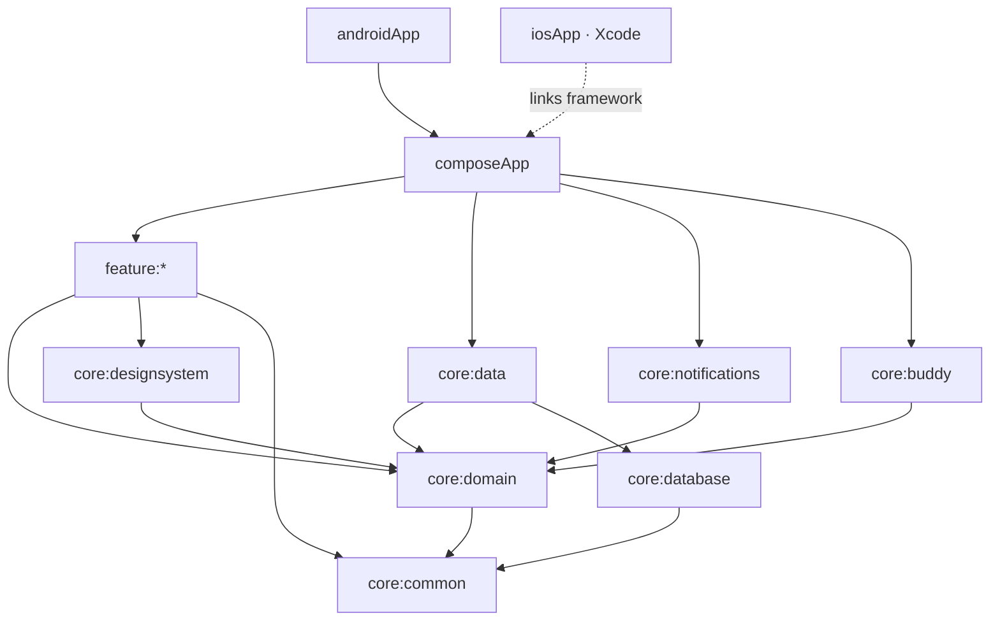

# DayBlocks

Plan your day in time blocks — and have a small, cheeky buddy who checks in, asks whether you're
actually doing the thing, and nudges you back when the phone wins.

DayBlocks exists because a passive planner is easy to ignore. Planning the day, even loosely, and
sticking to it helps; what makes the difference is something that *talks back*. So the core of
the app isn't the timeline, it's **Kubi**: an original rounded-block creature (rename it whatever
you like) who notices when a block starts, asks halfway through whether you're still on it, and
reacts to how the day is going.

Everything is local. No account, no backend, no network.

## Status

Built step by step, each step verified on both an Android emulator and an iOS simulator before
the next begins. See the [issues](https://github.com/Meko123456/DayBlocks/issues) for the plan.

| Step | Scope | State |
|---|---|---|
| 1 | Skeleton: modules, convention plugins, catalog, Koin, empty navigation | ✅ |
| 2 | Domain models, use cases, database, repositories | ✅ |
| 3 | Today screen: timeline, Now card, free-time gaps | ✅ |
| 4 | Add / edit block | ✅ |
| 5 | Templates and weekday assignment | ✅ |
| 6 | Notifications with action buttons, both platforms | — |
| 7 | Buddy engine and buddy UI | — |
| 8 | End-of-day check-in and stats | — |
| 9 | Widgets: Android Glance, iOS WidgetKit | — |
| 10 | Onboarding and settings | — |

## Architecture

Kotlin Multiplatform with Compose Multiplatform for the UI, one codebase for Android and iOS.

- **Clean Architecture.** `:core:domain` holds the models, repository interfaces and use cases, and
  is pure Kotlin: its only dependencies are kotlinx-datetime and coroutines. It cannot import
  Compose, Android or SQLDelight — they are not on its compile path.
- **MVI** in every screen: an immutable `State`, a sealed `Intent` for user actions and a sealed
  `Effect` for one-off events such as navigation. The ViewModel exposes `StateFlow<State>` and
  `Flow<Effect>`, and every intent goes through one reducer path.
- **Koin**, one module per Gradle module. `:composeApp` is the only place the full list is
  assembled and the only place Koin is started.
- **An injectable clock.** Nothing reads the system time directly; everything asks
  `TimeProvider`, so tests can move time through midnight, a DST change or a quiet-hours boundary.

### Module graph



`feature:*` is `onboarding`, `today`, `editblock`, `templates`, `checkin`, `stats` and `settings`.

Two rules the build enforces rather than documents:

1. **Features never depend on each other.** The `dayblocks.kmp.feature` convention plugin grants a
   feature its core dependencies and nothing else, so importing one feature from another does not
   compile. Screens raise navigation effects; only `:composeApp` knows the graph.
2. **Features never see `:core:data`.** They talk to repository interfaces in the domain. The
   implementations are bound at startup, so a screen cannot reach the database even by accident.

### Convention plugins (`build-logic`)

| Plugin | Adds |
|---|---|
| `dayblocks.kmp.library` | KMP with Android (via AGP 9's `com.android.kotlin.multiplatform.library`), `iosArm64`, `iosSimulatorArm64`; namespace derived from the project path; host tests |
| `dayblocks.kmp.compose` | Compose Multiplatform runtime, foundation, ui, Material 3 |
| `dayblocks.kmp.koin` | Koin core, plus koin-test for tests |
| `dayblocks.kmp.feature` | All three, plus domain, design system, lifecycle ViewModel, coroutines-test and Turbine |

Versions live in `gradle/libs.versions.toml` and match the rest of the fleet: AGP 9.4.1,
Kotlin 2.4.20, Gradle 9.7.1, Compose Multiplatform 1.11.0, compileSdk 37.

## Running it

You need JDK 17 or newer (Android Studio's bundled JBR works), and for iOS, Xcode plus
[XcodeGen](https://github.com/yonaskolb/XcodeGen) (`brew install xcodegen`).

### Android emulator

```sh
./gradlew :androidApp:installDebug
```

Or open the project in Android Studio and run the `androidApp` configuration.

### Android physical device

Enable developer options and USB debugging on the phone, connect it, confirm it shows up in
`adb devices`, then run the same `installDebug` command. With more than one device attached,
pick one with `ANDROID_SERIAL=<serial> ./gradlew :androidApp:installDebug`.

### iOS simulator

The Xcode project is generated from `iosApp/project.yml` rather than committed, so generate it
first. A build phase compiles the Kotlin framework for you.

```sh
cd iosApp
xcodegen generate
open iosApp.xcodeproj    # then pick a simulator and press Run
```

From the command line instead:

```sh
cd iosApp && xcodegen generate
xcodebuild -project iosApp.xcodeproj -scheme iosApp \
  -sdk iphonesimulator -destination 'platform=iOS Simulator,name=iPhone 17 Pro' build
```

### iOS physical device

Open the generated project, select the `iosApp` target, and under *Signing & Capabilities* choose
your own team — the committed configuration signs ad hoc, which only the simulator accepts. Then
select your iPhone as the run destination. The bundle identifier may need changing to something
unique to your team.

### Tests

```sh
./gradlew testAndroidHostTest         # every module's tests on the JVM — the fast loop
./gradlew iosSimulatorArm64Test       # the same tests on Kotlin/Native
```

The data layer's tests run against a real SQLite on both: sqlite-jdbc on the JVM, and on iOS the
system SQLite through the app's own driver, in memory.

The iOS app also has XCUITests that drive the shared UI end to end — add a block and find it on
Today, save the day as a template and find it listed. They launch with `DAYBLOCKS_UITEST` set, which gives the app an in-memory database so each
run starts from an empty plan:

```sh
cd iosApp && xcodegen generate
xcodebuild test -project iosApp.xcodeproj -scheme iosApp \
  -sdk iphonesimulator -destination 'platform=iOS Simulator,name=iPhone 17 Pro'
```

## A note on building iOS locally

Kotlin/Native 2.4.20 derives the search path for Swift compatibility libraries from the Xcode it
was *built* against, `Xcode_26.4.app`, rather than from `xcode-select`. On a machine with a single
`/Applications/Xcode.app`, any link that needs `-lswiftCompatibility51` then fails with a
"search path not found" warning — while CI stays green, because GitHub's macOS runner ships that
exact path. If you hit it, symlink it:

```sh
ln -s /Applications/Xcode.app /Applications/Xcode_26.4.app
```

## License

[MIT](LICENSE)
